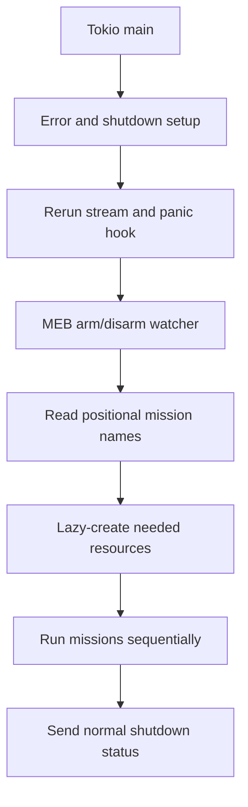

# Startup, Runtime, and Shutdown

## Why lifecycle matters

An ordinary command-line program can exit when its work is done. A robot program has ongoing responsibilities: keep communication alive, notice arm/disarm state, cancel a mission, and attempt to leave motion commands in a safe state. Understanding startup is therefore the fastest way to understand what SW9S considers a running robot.

## What starts first

`#[tokio::main]` on `src/main.rs` creates the async Rust runtime. The function then installs error reporting, creates a shutdown channel and cancellation token, starts Rerun telemetry, installs a panic hook, and launches an MEB arm/disarm watcher.

Resources are initialized lazily with Tokio `OnceCell`s. A `OnceCell` is a shared container that creates a value once, even when several async callers request it. SW9S uses it for `Config`, `ControlBoard`, MEB, front/bottom cameras, `ZedRos2`, and `FullActionContext`.

## Missions and cancellation

Each positional argument is passed to `run_mission`. Most mission futures are wrapped with `CancellationToken::run_until_cancelled`: cancellation stops waiting for the mission future, but it does not automatically undo a command already sent to hardware. The code uses a one-permit semaphore to coordinate shutdown with a running mission.

This is why an action's side effects matter. If a movement request was accepted by a board, dropping the Rust future is not itself a physical rollback.

## Important caution

**Source-derived / needs team confirmation:** the shutdown task attempts a control-board status query before commanding zero relative motion. The task is detached and not joined before `main` returns; the panic hook exits immediately. The deployed safety guarantee may depend on the external control-board watchdog, which is outside SW9S. Do not write operational shutdown instructions from source alone.

## Relevant source

- `src/main.rs`: `main`, `shutdown_handler`, `run_mission`, resource `OnceCell`s.
- `src/lib.rs`: `logln!`, global Rerun accessor, timestamped log file.
- `tokio-util::sync::CancellationToken` and Tokio synchronization primitives in `Cargo.toml`.

## Debugging and modification

For lifecycle work, first trace which lazy resource a mission requests and whether it starts background tasks. Log lifecycle transitions without changing board commands. Test cancellation behavior only with a team-approved environment.

## Last verified against SW9S

Source-derived from `fc780a1`; shutdown and watchdog behavior need team confirmation.
