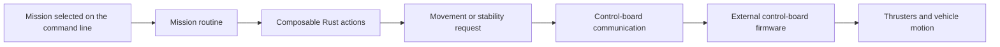
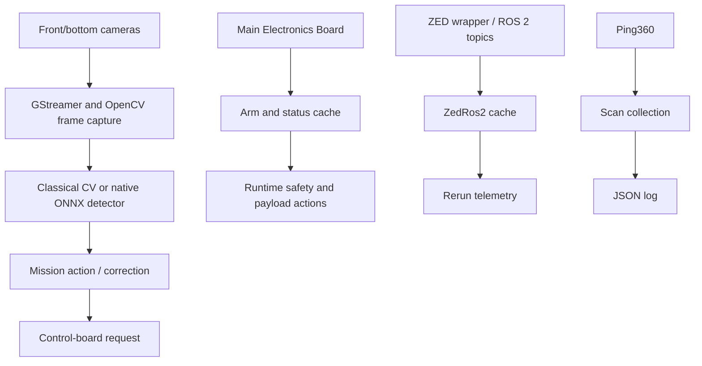

# SW9S in One Page

## Why this page exists

Before reading individual Rust files, it helps to know what role each part of the system plays. Think of SW9S as the software layer that turns an autonomous mission into requests that the vehicle's electronics can act on.

The application does not appear to compute every electrical output for every thruster on the Jetson. Instead, it can send the control board a higher-level movement or stability-assisted request. The control board and its external firmware then appear to own lower-level responsibilities such as translating that request into thruster behavior. The precise split, PID behavior, and deployed firmware version require team confirmation.

## The main path: mission to movement

A **mission** is a named behavior such as a gate run, path alignment, spin, sonar scan, or payload test. In `src/main.rs`, `run_mission` matches a command-line name to that behavior.

Many missions are built from **actions**. An action is a small asynchronous operation with a typed input/output relationship: for example, obtain a camera frame, detect an object, turn that detection into an offset, or send a movement command. The generic action model lives in `src/missions/action.rs`; movement actions live in `src/missions/movement.rs`.

The movement layer can send commands such as raw thruster values, relative degrees of freedom, global movement, or stability-assist requests. Those commands go through `src/comms/control_board/`, which uses the framed serial protocol in `src/comms/auv_control_board/`.

## The other information paths

### Cameras and native vision

The front and bottom cameras are opened through V4L2/GStreamer code in `src/video_source/appsink.rs`. A camera thread keeps the newest available OpenCV image in memory. Vision actions pull a frame, run a detector, and convert detections into values such as an image offset or angle.

Classical detectors for tasks such as gate, path, slalom, and octagon use color and contour processing under `src/vision/`. There is also a native OpenCV-DNN/ONNX path. Its tracked default model is currently a zero-byte placeholder, so it should not be described as a confirmed working vehicle path without team confirmation.

### MEB: vehicle status and payloads

The Main Electronics Board, or **MEB**, is a separate electronics interface. Its SW9S module, `src/comms/meb/`, caches status such as arm state, leak, voltage, temperature, humidity, and shutdown information, and exposes commands for payload mechanisms such as torpedoes and droppers.

The main runtime uses the debounced arm state for lifecycle behavior. The repository exposes other status values, but source inspection alone does not establish their deployed safety policy.

### ZED and ROS 2

The ZED path is separate from the native front/bottom camera pipeline. `src/comms/zed_ros2.rs` creates a Rust ROS 2 client, caches images, objects, and pose messages, and records them to Rerun.

At the inspected revision, the client uses hard-coded topic names and production missions do not appear to use the cached ZED pose or objects for movement. Treat that as a source-derived snapshot, not a statement about the current vehicle configuration; actual deployed topics and intended ZED role need confirmation.

### Sonar

The `sonar` mission communicates with a Ping360 through the Blue Robotics Ping library, collects a scan, and writes JSON output. The repository does not show that scan feeding a navigation or obstacle-avoidance decision yet.

## What SW9S owns—and what it does not show

| Visible in SW9S | Apparently external or needs confirmation |
|---|---|
| Mission dispatch, action composition, camera capture, vision code, serial messages, MEB interface, telemetry/logging | Control-board firmware behavior, detailed thruster control, physical wiring, PID calibration, deployed ZED topics/services, vehicle startup procedure |

This is the right mental model for a new contributor: SW9S is the orchestration and decision layer around several hardware interfaces. When changing it, ask both “does this Rust code compile?” and “what device or service receives the consequence of this decision?”

## Relevant SW9S source

- `src/main.rs`: composition root, resource initialization, mission dispatcher, lifecycle.
- `src/missions/action.rs` and `src/missions/action_context.rs`: action model and hardware capabilities.
- `src/missions/movement.rs`: movement requests and transforms.
- `src/comms/control_board/` and `src/comms/auv_control_board/`: control-board API and serial framing.
- `src/video_source/` and `src/vision/`: camera acquisition and native vision.
- `src/comms/meb/`, `src/comms/zed_ros2.rs`, and `src/missions/sonar.rs`: the other major data paths.

## Status

**Source-derived:** this page describes the SW9S `main` revision inspected for this handbook foundation. See [Documentation Status](../reference/documentation-status.md) and the [Team-Confirmation Register](../reference/team-confirmation-register.md) before treating inferred hardware behavior as operational procedure.
