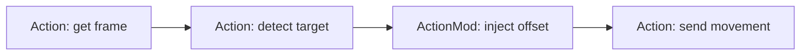

# Async Rust, Traits, and Actions

## Why this matters here

SW9S must wait for cameras, serial acknowledgements, ROS messages, and mission timing without freezing unrelated work. It uses async Rust so one task can wait for I/O while other tasks continue.

## Beginner mental model

An `async` function describes work that may pause, such as waiting for a camera image. A **future** is the unfinished promise of that work. Tokio is the runtime that schedules futures. A `Mutex` protects shared data; `Arc` lets multiple tasks share ownership safely.

A **trait** is Rust's way to describe a capability. A **generic** action can work with any context that provides the capabilities it needs. This lets SW9S express “this behavior needs a front camera and control board” without hard-coding every behavior to one giant object.

## SW9S implementation

`ActionExec<T>` in `src/missions/action.rs` is the core asynchronous action trait. `ActionMod<Input>` allows one action's result to modify the next. `ActionSequence`, `ActionChain`, conditionals, races, loops, and concurrent combinators build more complex behavior.

`src/missions/action_context.rs` defines capability traits such as `GetControlBoard`, `FrontCamIO`, and `GetZedRos2`. `FullActionContext` supplies the live resources.

## Important behavior

The action system passes typed results directly between awaited actions; it is not a message bus. A race cancels its losing future by dropping it, which does not undo hardware effects already sent. `FullActionContext` is also broad: source shows many action-style missions initialize more hardware than their immediate job logically needs.

## How to modify safely

Start by identifying an action's input, output, required capability traits, and physical side effects. Prefer pure transforms and testable data changes first. `EmptyActionContext` currently contains `todo!()` methods, so it is not a ready-made mock for hardware-free tests.

## Last verified against SW9S

Source-derived from `fc780a1`; action semantics are code-visible, mission operational readiness is not.
