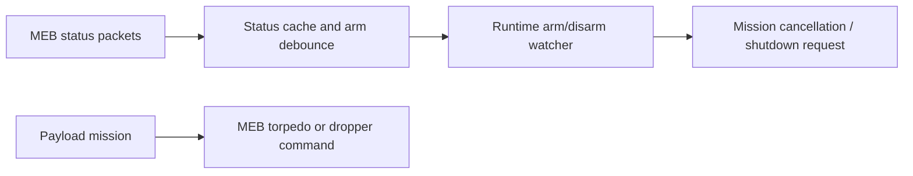

# Main Electronics Board (MEB)

## Why the MEB exists

The Main Electronics Board is SW9S's interface to vehicle status and payload mechanisms. It separates these concerns from the propulsion-focused control board.

## What SW9S sees and controls

`src/comms/meb/response.rs` caches temperature, humidity, leak, thruster-arm state, system voltage, shutdown cause, and acknowledgements. `src/comms/meb/mod.rs` provides torpedo, dropper, and reset commands.

The runtime's most visible use is the arm state. It waits for a stable sequence of matching arm readings before accepting a change, then a background watcher treats arm/disarm transitions as lifecycle events. This debounce avoids reacting to one noisy status packet.

## What this does not prove

Only arm status is visibly used by the main runtime. Leak, voltage, temperature, humidity, and shutdown information are available in the code but their real safety policy is not established here. One shutdown-status parsing path also deserves source review. Do not infer that the Jetson will respond to every MEB fault without team confirmation.

## Debugging and modification

Trace the status parser before adding a policy. Test debouncing with recorded/mocked messages. Payload commands are physical actions: require a safe bench procedure and hardware owner review.

## Last verified against SW9S

Source-derived from `fc780a1`.
