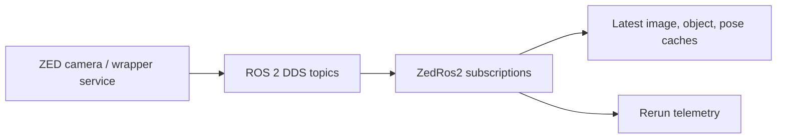

# ZED and ROS 2

## Why this is separate from native cameras

The ZED path is not the same as SW9S's front/bottom V4L2 cameras. It uses ROS 2, a robotics middleware in which independent processes exchange typed messages over named topics. This can let a camera wrapper run separately from the Rust mission application.

## SW9S implementation

`src/comms/zed_ros2.rs` creates `ZedRos2`, a Rust ROS 2 client. It launches a spinner task and subscriptions that keep the latest image, object list, and pose in shared caches. Those observations are also logged to Rerun.

A ROS **topic** is a named stream of typed messages; DDS is the network transport layer used beneath ROS 2 here. A cache means SW9S keeps the newest available message rather than a complete history.

## Current source snapshot

`ZedRos2::new` accepts a `ZedRos2Config`, but source inspection shows hard-coded image/object/pose topics instead of using those fields. Only `zed_test` visibly reads a cache, and it reads pose. Production missions do not visibly use the ZED cache for movement.

This is **source-derived**, not an assertion about the vehicle. Confirm real topic names, message types, namespace, wrapper launch, object-detection configuration, and intended mission role before publishing operational guidance.

## Relevant source

`src/comms/zed_ros2.rs`, `src/config/mod.rs::ZedRos2Config`, `docker/docker-compose.yml`, `docker/Dockerfile.ZED`, and `docker/zed-entrypoint.sh`.

## Last verified against SW9S

Source-derived from `fc780a1`.
