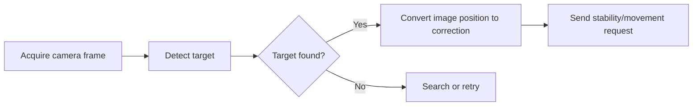

# Mission Catalogue and Data Flows

## How to read mission code

Mission names are not all the same kind of promise. Some are task behaviors, some are tests, and some are visibly incomplete. This catalogue explains their code paths without labeling them competition-ready.

| Area | Source-visible approach |
|---|---|
| Gate dead reckoning | Reads/uses initial yaw, then moves forward for a fixed duration. |
| Classical gate | Uses front-camera `GateCV`, then aligns/searches/strafe-yaws before traversal. |
| YOLO gate / coinflip | Uses `GatePoles` native ONNX-style detector; default model state is unverified. |
| Path alignment | Uses bottom-camera `PathCV` and normalized offset/angle to issue stability requests. |
| Slalom | Uses a front-camera red-pole detector with alignment/search/traverse stages. |
| Octagon | Uses action combinators and a classical octagon detector with several hard-coded values. |
| Spin | Uses IMU roll feedback and global roll-speed commands. |
| Torpedo | Sends MEB torpedo commands repeatedly. |
| Sonar | Collects and writes a Ping360 scan. |
| Bin | Currently a minimal/stub-like mission that enables IMU reads. |

## A typical visual behavior

The exact search policy, timing, camera, detector, and movement transform differ by mission. Read the named mission file alongside `src/missions/vision.rs` and `movement.rs`.

## Limitations

There is no central competition planner that automatically sequences a full run. The command line runs named missions sequentially. There is also no source-visible fused navigation estimate. Timed dead reckoning and camera-relative correction are not the same thing as map-based navigation.

## Last verified against SW9S

Source-derived from `fc780a1`. Use the confirmation register to classify current production readiness.
